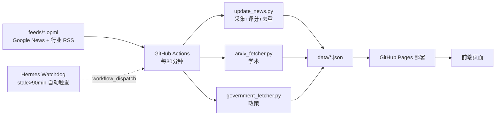

# 🤖 AI News Radar — 人形机器人/具身智能新闻雷达

[](https://jackliu-teadrinker.github.io/ai-news-radar/)
[](https://github.com/Jackliu-teadrinker/ai-news-radar/actions)
[](https://github.com/Jackliu-teadrinker/ai-news-radar/actions)
[](LICENSE)

[在线站点](https://jackliu-teadrinker.github.io/ai-news-radar/) · [English](README.en.md) · [协作指南](docs/radar-collaboration-guide.md)

---

## 📡 这是什么

**人形机器人 / 具身智能 / 脑机接口 / 物理 AI 领域的全球新闻雷达。**

自动追踪四大领域的全球最新动态，**每 30 分钟**由 GitHub Actions 自动采集、评分、去重并部署，覆盖国内外中英文信源，零人工值守。

**页面板块**（自上而下）：

| 板块 | 内容 | 数据文件 |
|------|------|----------|
| 📰 机器人信号流 | 主列表，全量去重新闻（CST 19:00 锚点 + 24h 窗口） | `latest-24h-all.json` |
| 📱 微信公众号 | 精选公众号文章（手动维护 + 采集器） | `wechat-articles.json` / `wechat-manual.json` |
| 🏛️ 政策专区 | 中国政府机器人与具身智能政策新闻 | `government-news.json` |
| 🎓 学术专区 | arXiv cs.RO 最新论文 | `arxiv-papers.json` |
| 🔗 精选锚点 | 高优先级站点（TechCrunch/IEEE/量子位等）精选 | `custom-anchors.json` |

---

## ✨ 功能特性

- **每 30 分钟自动更新**：GitHub Actions 驱动，零人工值守
- **国内外双源**：Google News 英文 5 组 + 中文 5 组，源名明确区分「国外/国内」
- **双语标题**：英文内容自动翻译为中文，标题对照阅读
- **行业专项过滤**：过滤股票涨跌、ETF、扫地机器人、快讯/短新闻等噪声
- **五维评分**：相关性/权威性/深度/时效性/写作价值，重要文章优先
- **归档去重**：21 天归档，SHA1(title+url) 全局去重
- **健康自愈**：独立 Watchdog 检测数据新鲜度，stale 时自动触发 workflow 补救

---

## 🗂️ 信源覆盖

| 分类 | 国外源（EN） | 国内源（ZH） |
|------|-------------|-------------|
| 人形机器人 | `humanoid robot` | 人形机器人 |
| 具身智能 | `embodied intelligence OR embodied AI` | 具身智能 |
| 脑机接口 | `BCI OR brain computer interface` | 脑机接口（修正自「脱机接口」URL 编码 bug） |
| 物理 AI | `physical AI` | 物理AI |
| 机器人综合 | `robot` | 机器人 |

> 所有 Google News 源带 `when=1d` 参数，优先返回最近 1 天内容。
> 锚点专区另有 TechCrunch、VentureBeat、IEEE Spectrum、IEEE Brain、HuggingFace、量子位、极链AI、Wired、雷锋网等 50+ 高优先级源。

---

## 🚀 快速开始

直接访问：[https://jackliu-teadrinker.github.io/ai-news-radar/](https://jackliu-teadrinker.github.io/ai-news-radar/)

本地运行：

```bash
git clone https://github.com/jackliu-teadrinker/ai-news-radar.git
cd ai-news-radar
python -m venv .venv
source .venv/bin/activate        # Windows: .venv\Scripts\activate
pip install -r requirements.txt
python scripts/update_news.py --output-dir data --window-hours 24
python -m http.server 8080
# 打开 http://localhost:8080
```

修改信源：编辑 `feeds/follow.example.opml`（主区块）或 `feeds/custom.opml`（锚点专区），commit 后自动部署。

---

## 🏗️ 架构



---

## 📁 项目结构

```
ai-news-radar/
├── feeds/                      # RSS 信源配置（OPML）
│   ├── follow.example.opml     # 主区块：国内外 10 组 Google News
│   ├── custom.opml             # 锚点专区：54 个高优先级源
│   └── government.opml         # 政策专区：政府官网源
├── scripts/
│   ├── update_news.py          # 主采集脚本（评分/去重/时间窗口）
│   ├── arxiv_fetcher.py        # 学术论文采集
│   ├── government_fetcher.py   # 政策新闻采集
│   ├── curated_collector.py    # 精选文章收集
│   └── wechat-collector-v2.py  # 微信采集（Hermes 维护）
├── data/                       # 输出数据（Pages 读取）
│   ├── latest-24h-all.json     # 全量新闻
│   ├── latest-24h-min.json     # AI 精选
│   ├── custom-anchors.json     # 锚点专区
│   ├── arxiv-papers.json       # 学术专区
│   ├── government-news.json    # 政策专区
│   └── wechat-*.json           # 微信专区
├── assets/
│   ├── index.html              # 前端页面
│   ├── app.js                  # 前端逻辑
│   └── styles.css              # 样式表
├── docs/                       # 协作/复盘文档
└── .github/workflows/
    └── update-news.yml         # 30min 自动更新 + 部署
```

---

## ⚙️ GitHub Actions

`.github/workflows/update-news.yml`：

- **cron**：`*/30 * * * *`（每 30 分钟）
- **push 触发**：任何 commit 自动运行
- **workflow_dispatch**：手动触发
- **auto-push**：自动 commit 数据 + Pages 部署

手动触发：

```bash
gh workflow run update-news.yml --repo Jackliu-teadrinker/ai-news-radar
```

---

## 🩺 健康监控

- **Hermes watchdog**（`radar_freshness_watchdog.py`）：每 15 分钟检查 Pages 数据新鲜度
- 数据 stale >90min → **自动触发 workflow_dispatch 自愈**
- 完整故障排查见 [协作指南](docs/radar-collaboration-guide.md)

---

## 📄 License

MIT
